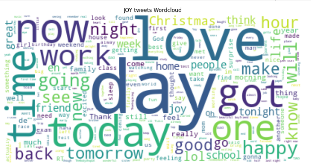
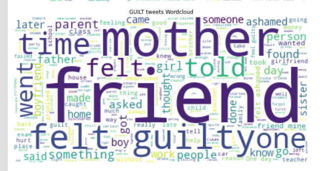

# (☞ﾟヮﾟ)☞ Emoji Predictor ᕕ( ᐛ )ᕗ  
  
## Sentiment Analysis  

L'analisi del sentiment è un termine generale per tecniche che quantificano l'umore in un testo. Puoi dire da un testo se lo scrittore è felice? Arrabbiato? Deluso? Puoi mettere la loro felicità su una scala 1-5?

Strumenti robusti per l'analisi del sentiment sono spesso molto desiderabili per le aziende, per esempio. 

Immaginiamo che un'azienda abbia appena lanciato un nuovo prodotto, il management vuole sapere come si sentono i clienti al riguardo. Invece di chiamare o scrivere a ogni persona che ha acquistato il prodotto, se potessimo semplicemente avere un'app web e trovare delle recensioni nei forum che discutono del prodotto e valutare automaticamente il loro atteggiamento nei confronti del loro recente acquisto, sarebbe possibile ottenere informazioni preziose gratuitamente. 

Poiché l'analisi del sentimento viene utilizzata così ampiamente per questo scopo, a volte viene chiamata [Opinion Mining](https://en.wikipedia.org/wiki/Sentiment_analysis).

Per essere davvero accurati nell'analizzare la sentiment bisogna comunque avere un umano che possa effettivamente verificare l'esattezza dei risultati. 
Ci sono molte sottigliezze nei testi che gli algoritmi informatici hanno ancora difficoltà a rilevare, per esempio, il sarcasmo. 

Ma, per molti scopi pratici, non occorre essere precisi al 100% nelle analisi perché lo strumento sia ​​utile. Un analizzatore di sentimenti che funziona correttamente l'80% delle volte può ancora essere molto prezioso. 
  
## Predirre delle Emoji 

La previsione delle **emoji** è una variante divertente dell'analisi della sentiment. Quando si scrivono dei messaggi agli amici per esempio, potrebbe essere utile allegare un'emoji che esprime lo stato emotivo o l'intenzione del messaggio, integrando questa funzionalità, ad esempio, in una tastiera virtuale.
  
In questo progetto, costruiamo un **classificatore** che impara ad associare emoji a frasi. 

Iniziamo con una grande quantità di frasi che contengono emoji raccolti dai messaggi di Twitter. 

Quindi esaminiamo le funzionalità di quelle frasi (parole, coppie di parole, ecc.) e addestriamo il nostro classificatore per associare determinate parole alla corrispondente emoji (ovviamente conosciute).

> Ad esempio, se il classificatore vede la parola "felice" in molte frasi nelle quali è anche presente lo smiley 😂, imparerà a classificare tali messaggi come 😂. 

D'altra parte, la parola "felice" potrebbe essere preceduta da "non", nel qual caso non dovremmo fare affidamento solo su singole parole da associare a determinate faccine. 

Per questo motivo, esaminiamo anche le sequenze di parole e, in questo caso, impareremo che "non felice" è fortemente associato alla tristezza, superando la parte "felice". Il classificatore impara quindi a guardare la totalità di molte sequenze di parole trovate in una frase e capisce quale classe di emoji caratterizzerebbe meglio quella frase. Sebbene il principio sia semplice, se avessimo milioni di parole di testo con emoticon note associate alle frasi, possiamo effettivamente addestrare abbastanza bene il nostro classificatore.
  
## Goal del progetto  

L'obiettivo di questo progetto è quindi prevedere un'emoji associata a un messaggio di testo. Per svolgere questo compito, abbiamo preso in considerazione diversi classificatori, che verranno approfonditi nelle prossime sezioni.
  
## Dataset psychExp  
  
Il dataset iniziale è stato scaricato dal [GitHub repository DeepMoji](https://github.com/bfelbo/DeepMoji/tree/master/data), è di 7480 istanze, poche per i nostri scopi.  
  
Il dataset psychExp è formato da un vettore con codifica One Hot che rappresenta le differenti emoji che andremo a predire:  
  
- Joy 😂  
- Fear 😱  
- Anger 😠  
- Sadness 😢  
- Disgust 😒  
- Shame 😓  
- Guilt 😳  
  
Ogni riga del dataset contiene un messaggio di testo e la codifica delle emoji, che sono rappresentate come un vettore:
```  
[ 1.  0.  0.  0.  0.  0.  0.] Passed the last exam.  
```  
In questo esempio, poiché la prima posizione del vettore è `1`, il testo è etichettato come un'istanza di Joy.
  
Il dataset è stato poi ampliato con circa 4000 istanze aggiuntive grazie ai dataset presenti in [questo sito](http://saifmohammad.com/WebPages/EmotionIntensity-SharedTask.html), siamo così arrivati a 11093 istanze, comunque poche, ma significative nel risultato finale.   
  
E' stata fatta una pulizia dei nuovi dataset tramite script bash per adattare il formato.  
  
```bash  
#!/bin/bash  
function clean {  
sed --regexp-extended "s/(^[0-9]{5})/$2/g" $1_raw | sed --regexp-extended "s/($1.*)//g" | sed --regexp-extended 's/(\&amp)|([💘©•âœ¨œŸ½¼ƒ§€™ˆ¤™€”¥»Œ¹ï¸™„¡‘Š¢—™Â£Ž­¿¾ž®ã‹])|(\&gt;)|(\\n)//g' > $1_clean  
}  
clean joy "[ 1. 0. 0. 0. 0. 0. 0.]"  
clean fear "[ 0. 1. 0. 0. 0. 0. 0.]"  
clean anger "[ 0. 0. 1. 0. 0. 0. 0.]"  
clean sadness "[ 0. 0. 0. 1. 0. 0. 0.]"  
  
```  
  
### Features  

Un messaggio di testo è una serie di parole. Per poter elaborare i messaggi di testo, abbiamo convertito il testo in features.
  
Uno dei metodi per convertire un testo in features è chiamato [n-grammi](https://en.wikipedia.org/wiki/N-gram). Un n-gramma è una sequenza di n parole di un dato testo. Un bigramma (bigram) è una sequenza di due parole, ad esempio "Ciao ragazzi" e un trigramma (trigram) è una sequenza di tre parole come "il tuo progetto" o "passa i compiti".

Per questo progetto, in primo luogo, convertiamo tutti i testi in lettere minuscole. Quindi, creiamo n-grammi con un intervallo da 1 a 4 e contiamo quante volte ogni n-gramma appare nel testo.
   
## Classificatori  

La costruzione di un modello prevede principalmente due passaggi. 

 - Addestrare un modello. 
 - Valutiamo il modello su un set di dati separato.
	 - Cioè non valutiamo le prestazioni sugli stessi dati da cui abbiamo appreso. 

Abbiamo scelto vari classificatori, i quali vengono addestrati per vedere quale funziona meglio per questo progetto. 

Sono stati testati i seguenti classificatori:  
+ `SVC`  
+ `LinearSVC`  
+ `RandomForestClassifier`  
+ `DecisionTreeClassifier`  
+ `PassiveAggressiveClassifier`  
+ `SGDClassifier`  
+ `RidgeClassifier`  

Per info sui vari classificatori rimandiamo alla [documentazione ufficiale](https://scikit-learn.org/stable/modules/classes.html#module-sklearn.linear_model).

I dati sono divisi 90-10, il 90% per il training set e il 10% per il testing. Abbiamo scelto il 10% per essere sicuri di avere un numero sufficiente di dati per la parte di testing e per evitare il più possibile l'overfitting. Separando i dati, inoltre, ci assicuriamo che il modello si generalizzi bene e possa funzionare bene anche con frasi del tutto sconosciute.
  
Valutiamo le prestazioni di ciascun modello calcolando l'accuracy. 

## Confronto dei classificatori  
  
### Dataset psychExp originale  
  
| Classifier                  | Training Accuracy | Test Accuracy |  
| --------------------------- | ----------------- | ------------- |  
| SVC                         | 0.9119133         | 0.4612299     |  
| LinearSVC                   | 0.9988116         | 0.5855615     |  
| RandomForestClassifier      | 0.9988116         | 0.5467914     |  
| DecisionTreeClassifier      | 0.9988116         | 0.4425134     |  
| PassiveAggressiveClassifier | 0.9986631         | 0.5802139     |  
| SGDClassifier               | 0.9988116         | 0.5655080     |  
| RidgeClassifier             | 0.9962864         | 0.6029412     |  

### Dataset psychExp esteso  
  
L'accuratezza per il training e per il test di ogni classificatore sono riassunte nella tabella.  
  
| Classifier                  | Training Accuracy | Test Accuracy |  
| --------------------------- | ----------------- | ------------- |  
| SVC                         | 0.9249725         | 0.5054054     |  
| LinearSVC                   | 0.9949915         | 0.6171171     |  
| RandomForestClassifier      | 0.9949915         | 0.5585586     |  
| DecisionTreeClassifier      | 0.9949915         | 0.5117117     |  
| PassiveAggressiveClassifier | 0.9949915         | 0.5819820     |  
| SGDClassifier               | 0.9942903         | 0.6324324     |  
| RidgeClassifier             | 0.9939898         | 0.6477477     |   
  
Guardando i risultati, LinearSVC lavora bene, cosi come SGDClassifier e RidgeClassifier, in Ridge l'accuratezza è leggermente superiore rispetto agli altri classificatori.  
  
In generale possiamo notare che abbiamo sempre una training accuracy maggiore della test accuracy, abbiamo inevitabilmente dell'overfitting.  
  
Dal momento che RidgeClassifier sembra lavorare bene, abbiamo fatto un tuning dei parametri per minimizzare l'overfitting.  
  
  
## Final model  
  
Nel RidgeClassifier in particolare ci siamo soffermati sulla scelta del solver più adatto, alla fine abbiamo optato per una Stocastic Average Gradient Descent, sia 'sag' che 'saga' utilizzano la Stochastic Average Gradient Descent, ma 'saga' usa la versione imparziale e più flessibile. Entrambi i metodi usano una procedura iterativa e sono spesso più veloci di altri solvers quando il numero delle feature è elevato.  

### Dataset psychExp originale  
  
 Il modello finale ha avuto i seguenti risultati:  
   
 | Validation Accuracy | Training Accuracy  | Test Accuracy      | Best parameter |  
 | --------------------| -------------------|--------------------|----------------|  
 | 0.5932899150718509  | 0.9939096850861556 | 0.5989304812834224 | alpha = 10     | 
  
### Dataset psychExp esteso  

Il modello finale ha avuto i seguenti risultati:  
  
| Validation Accuracy | Training Accuracy | Test Accuracy     | Best parameter |  
| --------------------| ----------------- |-------------------|----------------|  
| 0.6342794251497487 | 0.9936892717619954 | 0.6522522522522523| alpha = 2      |

Come ci aspettavamo, a causa delle dimensioni del dataset, l'accuracy non è alta, ma accettabile.

### Dataset psychExp esteso(ancora una volta)

Abbiamo trovato elementi per aumentare il dataset ancora una volta.  
Il modello finale ha avuto i seguenti risultati:  
  
| Validation Accuracy | Training Accuracy | Test Accuracy     | Best parameter |  
| --------------------| ----------------- |-------------------|----------------|  
| 0.6493401360280142 | 0.9739670665118879 | 0.668988198877926| alpha = 0.2      |  
  
Come ci aspettavamo, l'accuracy è cresciuta seppur non di molto. 
  
## Analisi degli errori  
  
Analizziamo i risultati della classificazione dal modello con le migliori prestazioni (RidgeClassifier), utilizzando una **Confusion Matrix**.

Una Confusion Matrix è una tabella che riassume le prestazioni di un algoritmo di classificazione e rivela il tipo di classificazione errata che si potrebbe verificare. 
In altre parole, mostra la confusion del classificatore tra le classi. Le righe nella matrice rappresentano le etichette vere e le colonne sono etichette previste. 

> Un classificatore perfetto avrebbe grandi numeri sulla diagonale principale e zero ovunque.
  
È ovvio che il classificatore ha appreso molti schemi significativi: i numeri lungo la diagonale sono molto più alti rispetto alla diagonale. Ciò significa che delle frasi che esprimono effettivamente rabbia viene spesso classificata come **Anger** e così via.
  
D'altra parte, il classificatore tende spesso a classificare erroneamente i messaggi di testo associati a colpa, vergogna e disgusto. Oltre al dataset ridotto, potrebbe anche dipendere dal fatto che è difficile individuare parole specifiche o sequenze di parole che caratterizzano questi sentimenti, è più probabile che i tweet che coinvolgono **Joy** abbiano parole come "buono", "mi piace" o "felice", il classificatore quindi è in grado di gestire molto meglio tali sentimenti.
  
### Dataset psychExp originale  
  
La conta degli elementi è data dalla seguente tabella:   
  
| Emoji  | One Hot              | Count |  
| ------ | -------------------- | ----- |  
|joy     |(1. 0. 0. 0. 0. 0. 0.)|1084   |  
|fear    |(0. 1. 0. 0. 0. 0. 0.)|1078   |  
|anger   |(0. 0. 1. 0. 0. 0. 0.)|1080   |   
|sadness |(0. 0. 0. 1. 0. 0. 0.)|1079   |  
|disgust |(0. 0. 0. 0. 1. 0. 0.)|1057   |  
|shame   |(0. 0. 0. 0. 0. 1. 0.)|1045   |  
|guilt   |(0. 0. 0. 0. 0. 0. 1.)|1057   | 
  
La confusion matrix per il dataset originale si presenta quindi in questo modo  
  

  
### Dataset psychExp esteso  
  
La conta degli elementi è data dalla seguente tabella:   
  
| Emoji  | One Hot              | Count |  
| ------ | -------------------- | ----- | 
|joy     |(1. 0. 0. 0. 0. 0. 0.)|1907   | 
|fear    |(0. 1. 0. 0. 0. 0. 0.)|2225   |  
|anger   |(0. 0. 1. 0. 0. 0. 0.)|1937   |   
|sadness |(0. 0. 0. 1. 0. 0. 0.)|1865   |  
|disgust |(0. 0. 0. 0. 1. 0. 0.)|1057   |
|shame   |(0. 0. 0. 0. 0. 1. 0.)|1045   |  
|guilt   |(0. 0. 0. 0. 0. 0. 1.)|1057   |  
 
  
La confusion matrix per il dataset esteso si presenta quindi in questo modo  
  
  
  
### Dataset psychExp nuovamente esteso  
  
Abbiamo trovato elementi per aumentare il dataset ancora una volta.
La conta degli elementi è data dalla seguente tabella:   
  
| Emoji  | One Hot              | Count |  
| ------ | -------------------- | ----- | 
|joy     |(1. 0. 0. 0. 0. 0. 0.)|17641   | 
|fear    |(0. 1. 0. 0. 0. 0. 0.)|10549   |  
|anger   |(0. 0. 1. 0. 0. 0. 0.)|5816   |   
|sadness |(0. 0. 0. 1. 0. 0. 0.)|10236   |  
|disgust |(0. 0. 0. 0. 1. 0. 0.)|3009   |
|shame   |(0. 0. 0. 0. 0. 1. 0.)|1045   |  
|guilt   |(0. 0. 0. 0. 0. 0. 1.)|3391   |  
  
 La confusion matrix per il dataset esteso si presenta quindi in questo modo  
  
  

Possiamo notare che le emoji con meno entry nel database sono quelle che risultano meno precise per cui in generale il dataset si presenta sbilanciato. 
  
## Reti Neurali
Al fine di migliorare i risultati ottenuti attraverso l'uso di Classificatori, abbiamo pensato di utilizzare le Reti Neurali. 
Una Rete Neurale Artificiale è un modello di machine learning che riesce apprendere relazioni non lineari nei dati, anche molto complesse. Diversi neuroni sono disposti su diversi strati posti in sequenza, i neuroni di strati successivi sono connessi ai neuroni degli strati precedenti tramite dei pesi.

Il primo strato di una rete neurale prende in input le features, l’ultimo strato fornisce l’output della rete, mentre gli strati intermedi, chiamati anche strati nascosti (o hidden layer), utilizzano le features provenienti dallo strato precedente per apprendere nuove features più significative per l’obiettivo della nostra rete. Nell’ambito del deep learning i neuroni vengono chiamati anche unità o nodi.

  

Il numero di strati e di nodi di una rete neurale è uno degli ***iperparametri*** del modello, cioè quei parametri che tocca a noi definire e ottimizzare. Strati nascosti differenti possono avere un numero di nodi differenti, per questo motivo le reti neurali sono uno strumento potente quanto complesso e andrebbero utilizzare solo nei casi in cui modelli più semplici si rivelano inefficaci per il nostro problema.

Altri ***iperparametri*** noti sono: 

+ ***numero di nodi di ogni hidden layer***: The ith element represents the number of neurons in the ith hidden layer.
+ ***solver***: The solver for weight optimization.
		‘lbfgs’ is an optimizer in the family of quasi-Newton methods.
		‘sgd’ refers to stochastic gradient descent.
		‘adam’ refers to a stochastic gradient-based optimizer.
+ ***alpha***: L2 penalty parameter (per mitigare l'overfitting).
+ ***dimensione batch***: Size of minibatches for stochastic optimizers.
+ ***Learning rate***: Learning rate schedule for weight updates.
		‘constant’ is a constant learning rate given by ‘learning_rate_init’.
		‘invscaling’ gradually decreases the learning rate at each time step ‘t’ using an inverse scaling exponent of ‘power_t’. 			effective_learning_rate = learning_rate_init / pow(t, power_t)
		‘adaptive’ keeps the learning rate constant to ‘learning_rate_init’ as long as training loss keeps decreasing. Each time 			two consecutive epochs fail to decrease training loss by at least tol, or fail to increase validation score by at 			least tol if ‘early_stopping’ is on, the current learning rate is divided by 5.
+ ***tolerance***: Tolerance for the optimization. When the loss or score is not improving by at least tol, onvergence is considered to 			be reached and training stops.

Non sono gli unici ma i principali per garantire alla rete neurale il comportamento desiderato. Per altre info consultare la [documentazione](https://scikit-learn.org/stable/modules/classes.html#module-sklearn.neural_network).

### Primo addestramento 
Il primo tentativo di addestramento ha visto la scelta della rete neurale MLPClassifier. Il tuning dei parametri è stato il seguente: 

 | hidden_layer_sizes  | max_iter | alpha  | solver | verbose | random_state | tol         |
 | --------------------| ---------|--------|--------|---------|--------------|-------------|
 | (100,100,100)       | 500      | 0.0001 | lbfgs  | True    | 21           | 0.000000001 |
 
Il tempo di addestramento è stato di ***1 ora circa*** portando al risultato:

 | Training Accuracy   | Test Accuracy         |
 | --------------------| ----------------------|
 | 0.9949914855253932  | 0.5810810810810810810 |
 
#### Analisi Errori
  

### Secondo addestramento
Il secondo tentativo di addestramento ha visto la scelta della rete neurale MLPClassifier. Il tuning dei parametri è stato il seguente: 

 | hidden_layer_sizes  | max_iter | alpha  | solver | verbose | random_state | tol         |
 | --------------------| ---------|--------|--------|---------|--------------|-------------|
 | (100,100,100)       | 500      | 0.0001 | sgd    | True    | 21           | 0.000000001 |
 
Il tempo di addestramento è stato di ***2 ore circa*** portando al risultato:

 | Training Accuracy   | Test Accuracy      |
 | --------------------|--------------------|
 | 0.9949914855253932  | 0.6                |
 
#### Analisi Errori


### Terzo addestramento
Il terzo tentativo di addestramento ha visto la scelto della rete neurale MLPClassifier. Il tuning dei parametri è stato il seguente: 

 | hidden_layer_sizes    | max_iter | alpha  | solver | verbose | random_state | tol         | learning_rate | batch_size |activation
 | ----------------------|----------|--------|--------|---------|--------------|-------------|---------------|------------|---------|
 | (100,100,100,100,100) | 500      | 0.0001 | sgd    | True    | 21           | 0.000000001 | adaptive    | 64         | tanh|
 

Il tempo di addestramento è stato di ***2 ore circa*** portando al risultato:

| Training Accuracy   | Test Accuracy      |
| --------------------| -------------------|
| 0.9949914855253932  |          0.60270270270270          |
 
#### Analisi Errori


### WordCloud
Parallelamente alle NN abbiamo, causa il basso numero di elementi nel dataset, applicato delle wordcloud. Preso il dataset iniziale, lo abbiamo diviso per sentiment e per ogni emoji abbiamo generato una wordcloud corrispondente. Le wordcloud sono delle strutture friendly per visualizzare informazioni utili riguardo un sottinsieme del dataset. Ogni nuvola contiene un insieme di parole la cui visualizzazione è influenzata dall'occorrenza della parola stessa: se una parola è presente ed influenza quindi in maniera importante quel sottinsieme, questa sarà, rispetto alla nuvola, centrata e con un font di dimensioni maggiori. Nel nostro caso applicando queste ad ogni emoji, abbiamo potuto osservare quali fossero le parole più influenti per la classificazione di una frase tra i sentiment trattati.

In particolare per il sentiment JOY:



In particolare per il sentiment DISGUST:


In particolare per il sentiment FEAR:


In particolare per il sentiment GUILT:



In particolare per il sentiment SHAME:


In particolare per il sentiment SADNESS:


In particolare per il sentiment ANGER:


### Future Work   
I risultati sui diversi classificatori sono sicuramente incoraggianti: possiamo affermare che con un dataset più ampio potremmo sicuramente diminuire l'overfitting e quindi prestazioni migliori in termini di accuracy.   
  
La confusion matrix ci permette graficamente di vedere il numero di errori di classificazione e quali sono le emozioni che vengono confuse più spesso.  
  
Non possiamo escludere che al crescere del dataset il classificatore che ottiene prestazioni migliori rimanga il RidgeClassifier.

Dopo aver applicato diversi tuning alla NN MLPClassifier ci siamo resi conto come con uno strumento del genere, partendo dal dataset in nostro possesso, non fosse possibile ottenere risultati migliori ottenuti con il classificatore Ridge.

L'idea che il dataset abbia dimensioni troppo ridotte è sostenuto oltre che dall'evidenza (numero di tweets di circa 12K) anche dall'applicazione di strutture quali le wordcloud. Queste sono un'evidenza lampante di come per diversi sentiment analizzati alcune parole ricorrano in più di una wordcloud relativa. Questo cosa significa? Per esempio la parola "FRIEND" appare in ogni wordcloud, evidenziando come questa parola sia ambigua ai fini della classificazione.


 
 ٩( ᐛ )و Ciro Santillo && Giammarco Sommaini ヽ(´▽｀)ノ
 
 ( ⌒o⌒)人(⌒-⌒ )v
